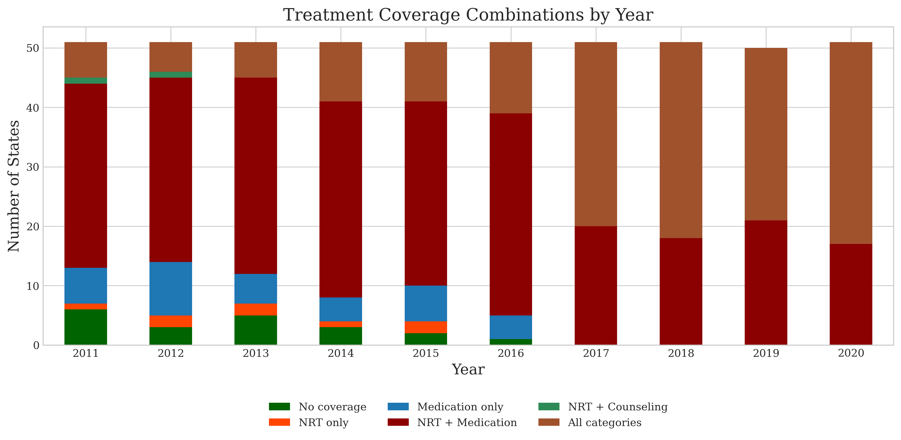

# State Tobacco Analysis

## I. Overview
This project analyzes the effectiveness of different Medicaid tobacco cessation coverage policies across US states from 2011 to 2020. The analysis focuses on two combination of treatment approaches:
1. NRT (Nicotine Replacement Therapy) + Medication
2. NRT + Medication + Counseling

The study examines how these different coverage combinations affect two key outcomes:
- Smoking prevalence rates
- Quit success rates

The project includes comprehensive data cleaning, preparation, and visualization to identify trends and patterns in tobacco cessation outcomes based on state-level policy differences.

## II. Input Data Sources
The analysis uses several data sources:
- **BRFSS Data (2011-2020)**: Behavioral Risk Factor Surveillance System survey data containing individual-level smoking behaviors and demographic information. 
    - Source: https://www.cdc.gov/brfss/annual_data/annual_data.htm
- **Medicaid Expansion Data**: State-level information on Medicaid expansion status. 
    - Source: https://www.kff.org/status-of-state-medicaid-expansion-decisions/

- **State Tobacco Activities Tracking and Evaluation (STATE) system Data**: Presents data on traditional Medicaid coverage of tobacco cessation treatments across all 50 states and D.C., serving as a national resource for assessing state-level cessation policies. 
    - **Cessation Treatments Coverage Data**: Details on which tobacco cessation treatments are covered by Medicaid in each state
    - Source: https://www.cdc.gov/statesystem/index.html
- **US Census FIPS Code Mapping**: For standardizing state identifiers. 
    - Source: https://transition.fcc.gov/oet/info/maps/census/fips/fips.txt
- **Federal Poverty Level (FPL) Information**: Annual poverty thresholds used to determine Medicaid eligibility. 
    - Source: https://aspe.hhs.gov/topics/poverty-economic-mobility/poverty-guidelines

The analysis focuses on the Medicaid-eligible population (individuals at or below 100% of the Federal Poverty Level).

## III. Script Descriptions

### Data Cleaning.py
This script performs the initial data preparation process:
- Merges BRFSS data across all years (2011-2020)
- Joins with state-level policy data (Medicaid expansion, cessation coverage, smokefree air laws, cigarette taxes)
- Standardizes adult household variables across survey years
- Calculates Federal Poverty Level percentages for each respondent
- Creates Medicaid eligibility indicators
- Applies sample filters: Medicaid-eligible respondents with no children

### Data Prepare.py
This script creates the analytical dataset:
- Cleans and standardizes individual-level smoking status variables
- Creates outcome variables (current smoking, former smoking, quit attempts)
- Generates demographic control variables
- Creates treatment category indicators for different cessation coverage combinations
- Aggregates individual-level data to create state-level prevalence measures
- Categorizes states into mutually exclusive treatment groups
- Restricts sample to two key treatment groups for focused analysis:
  - Group 2: NRT + Medication
  - Group 4: NRT + Medication + Counseling

### Data Visual.py
This script creates the core visualizations for analyzing outcome trends:
- Smoking prevalence trends by treatment group (2011-2020)
- Quit success rate trends by treatment group (2011-2020)
- Average outcomes bar chart comparing treatment approaches
- Uses consistent color schemes and formatting for visual clarity
- Includes statistical annotations (averages, trends)

### Visual Maps.py
This script generates geographic visualizations:
- Creates choropleth maps showing state-level outcomes
- Uses dual-color scheme to differentiate treatment groups while showing outcome intensity
- Produces maps for both smoking prevalence and quit success rates
- Compares outcomes between 2011 and 2020 to show changes over time
- Uses GIS data (shapefiles) for accurate geographic representation

### Treatment Coverage by year Visual.py
This script creates a stacked bar chart showing:
- The distribution of different treatment coverage combinations by year
- How coverage policies evolved across states during the study period
- The relative prevalence of each coverage combination
- Treatment group transitions over time

## IV. Generated Visualizations

### Smoking Prevalence Trends (2011-2020)

The line graph tracking smoking prevalence reveals several key insights:

- Both treatment groups started with high smoking prevalence in 2011, with the comprehensive "NRT + Medication + Counseling" group initially showing higher rates (36.5% vs. 34%)
- By 2020, this relationship reversed dramatically, with the comprehensive treatment group showing substantially lower smoking prevalence (27% vs. 29.5%)
- The comprehensive treatment group demonstrates a clearer downward trend over the decade (9.5 percentage point reduction vs. 4.5)
- While both groups experience year-to-year fluctuations, the comprehensive coverage group shows a more consistent downward trajectory since 2016
- Long-term averages are similar (30.9% for NRT + Medication vs. 30.3% for comprehensive coverage), but the trend lines suggest diverging outcomes in more recent years

### Quit Success Rate Trends (2011-2020)

The quit success rate visualization shows:

- Overall quit success rates are relatively low for both groups (averaging 3.9% and 4.0%)
- The comprehensive coverage group (NRT + Medication + Counseling) maintains a slight advantage in average quit success rates
- Both groups show significant year-to-year fluctuations, making trends difficult to isolate

### Average Outcomes Comparison

The bar chart summarizing average outcomes across the entire decade shows:

- States with comprehensive coverage have slightly lower average smoking prevalence (30.3% vs. 30.9%)
- States with comprehensive coverage show marginally better quit success rates (4.0% vs. 3.9%)
- The magnitudes of these differences are small but consistent across both outcome measures

### Geographic Distribution Maps
The choropleth maps reveal important spatial and temporal patterns:

### 2011 Smoking Prevalence Map:

- Treatment approaches show distinct regional patterns, with NRT + Medication more common in the Northeast, Midwest, and West
- Comprehensive coverage appears in scattered states across different regions
- Some states with comprehensive coverage still show high smoking prevalence (red shading), particularly in the Midwest
- Several southeastern states have no data or no coverage (white)

### 2020 Smoking Prevalence Map:

- A dramatic shift in coverage patterns is evident, with many more states adopting comprehensive coverage
- States with comprehensive coverage generally show lower smoking prevalence (lighter orange shading)
- The West and Northeast regions show particularly strong improvements
- Some southern states maintained high smoking prevalence despite policy changes

### Quit Success Rate Map (2011):

- In 2011, most states show relatively low quit success rates regardless of treatment approach
- Wisconsin stands out with remarkably high quit success rates under the NRT + Medication approach (dark blue). Arkansas stands out as having higher quit success rates with comprehensive coverage (darker orange)
- Several states with comprehensive coverage (NRT + Med + Counseling) show low quit success rates (light peach), particularly in the western region (Nevada)
- The midwest shows a mix of high and low quit success rates, suggesting state-specific implementation factors. Many southern states have no data or no coverage (white areas)

### Quit Success Rate Map (2020):

- By 2020, the map shows a dramatic shift with many more states adopting comprehensive coverage
- Texas shows notably high quit success rates with comprehensive coverage (darker orange)
- Several western states that switched to comprehensive coverage show improved quit success rates
- The northeastern region predominantly adopted comprehensive coverage with generally moderate success rates
- Few states maintained the NRT + Medication approach by 2020, with those that did showing mostly average results

### Treatment Coverage Combinations by Year

The stacked bar chart showing treatment coverage evolution reveals:

- A dramatic shift in coverage approaches over the decade
- In 2011, a mix of coverage combinations existed, with NRT + Medication being most common
- By 2017-2020, the field consolidated into primarily two approaches: NRT + Medication and All Categories (comprehensive coverage)
- The proportion of states offering comprehensive coverage (All Categories) increased substantially from 2011 to 2020
- By 2020, comprehensive coverage became the dominant approach
- Other combination approaches (NRT only, Medication only, NRT + Counseling) virtually disappeared by the end of the study period
- The green segment (No Coverage) significantly diminished over time, showing expanded Medicaid cessation coverage nationally

## V. Conclusions

Based on the analysis and visualizations, several key findings emerge:

1. **Emerging Comprehensive Coverage Effectiveness**: While the decade-long averages show only modest differences between treatment approaches, the visualizations reveal a growing advantage for comprehensive coverage in later years. By 2020, states with comprehensive coverage demonstrated notably lower smoking prevalence (27% vs. 29.5%), suggesting that the full benefits of comprehensive cessation support may take time to materialize.

2. **Temporal Trends in Policy Adoption**: The dramatic shift in coverage approaches—from diverse combinations in 2011 to a consolidated focus on comprehensive coverage by 2020—reflects evolving best practices in tobacco cessation policy. This nationwide policy convergence suggests increasing consensus among policymakers about optimal cessation support structures.

3. **Variability in Treatment Response**: The significant year-to-year fluctuations in both smoking prevalence and quit success rates indicate that treatment effectiveness may be influenced by factors beyond coverage policies alone. Economic conditions, public awareness campaigns, and complementary tobacco control measures likely play important roles in determining outcomes.

4. **Geographic Implementation Patterns**: The geographic visualization reveals that by 2020, comprehensive coverage approaches became widespread across diverse regions, representing a significant change from the more fragmented coverage landscape of 2011. This suggests successful policy diffusion across state boundaries despite regional differences in tobacco use patterns.

5. **Long-term Investment in Comprehensive Approaches**: The data shows that the advantage of comprehensive coverage becomes more pronounced in the latter part of the study period. States that implemented and maintained comprehensive coverage saw greater improvements in smoking prevalence over time, suggesting that consistent, long-term investment in multi-faceted cessation support yields the best outcomes.

6. **Modest but Consistent Quit Success Rates**: While quit success rates remain relatively low overall (3-4%), the comprehensive coverage approach maintained a slight advantage throughout most of the study period. This suggests that including counseling alongside pharmacotherapy provides a small but potentially meaningful improvement in cessation support effectiveness.

These findings provide evidence-based insights for policymakers considering modifications to Medicaid tobacco cessation coverage. The analysis suggests that comprehensive approaches that include behavioral support alongside pharmacotherapy offer the strongest potential for reducing smoking prevalence among Medicaid-eligible populations, particularly when implemented consistently over time.
